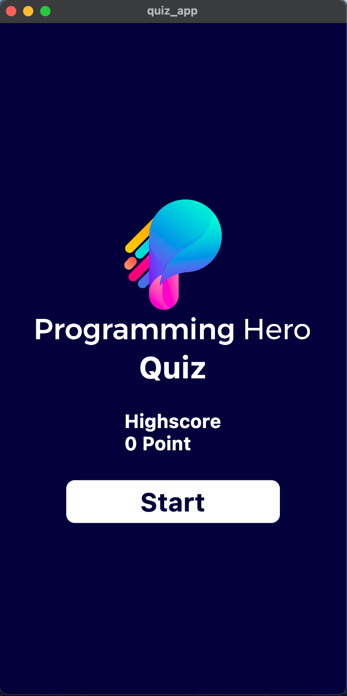
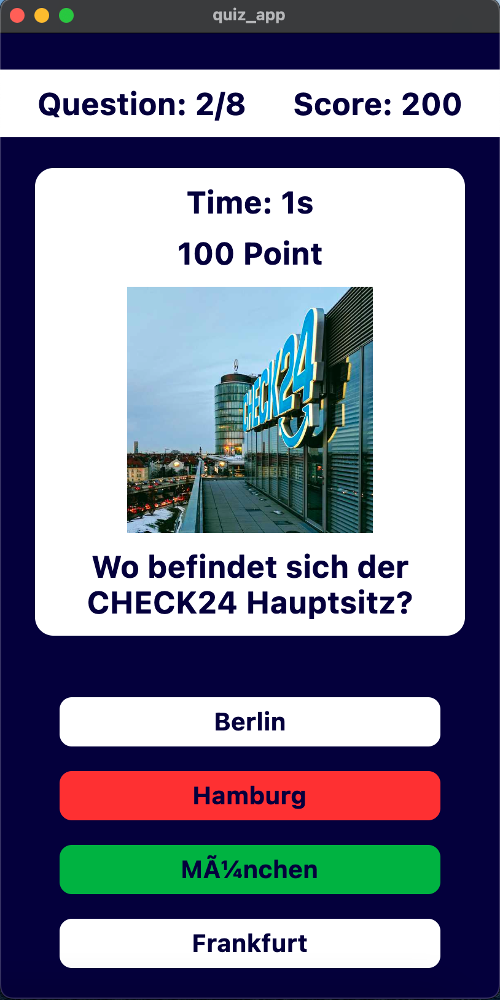
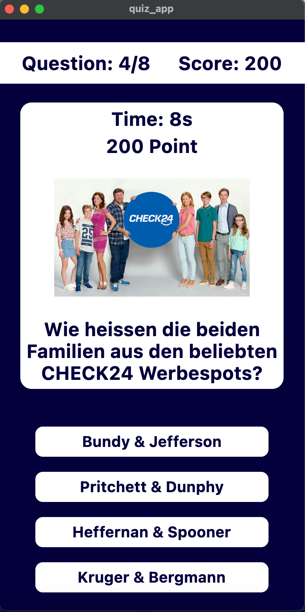
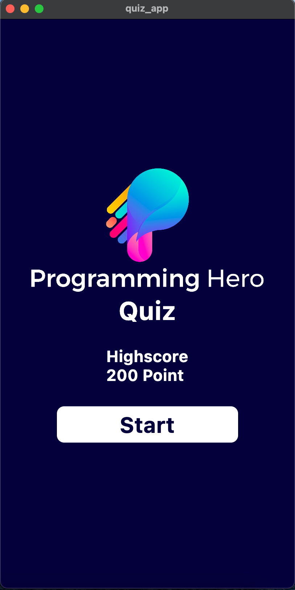

# Flutter Quiz App
------------------------------------------------------------ 
This application is a test task given by "Programming Hero". 
------------------------------------------------------------ 
 

Some Screenshots of the project: 
Home Page (without any highscore)  |  Quiz Page (wrong answer given - 2s to show)  |  
:-------------------------:|:-------------------------:
  |  

Quiz Page (no answer given - 10s to show)  |  Home Page (with highscore)  |  
:-------------------------:|:-------------------------:
  |  

 

Test apk link: https://drive.google.com/file/d/1lU6S4nvasznhaNUBwAjIPQU3YCCjFZSP/view?usp=sharing
